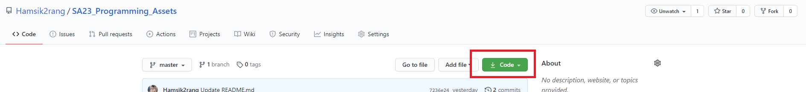

# SA23_Programming_Assets
이 곳은 Striking Arts 23기 하계방학 실습을 위한 프로젝트 공간입니다!

해당 실습 예제 프로젝트를 다운로드 받기 위해선 Git Client를 이용해 본 레포지토리를 클로닝 하거나, 우측 상단 **Code** 버튼을 누른 후 Download ZiP을 통해 압축 형태로 다운로드 할 수 있습니다.

모든 실습은 **Unity 2019.4.5f** 버전을 기준으로 진행됩니다. 해당 버전보다 하위 버전에서 실행 시 문제가 생길 수 있습니다.

## 실습 1 (Game 1)

2D 플랫포머 게임 제작 실습입니다.

실습 1을 통해 학습할 내용은 다음과 같습니다.

*   레벨 아트의 생성과 타일맵 배치 방법을 배워봅니다.

*   2D 게임에서의 플레이어 캐릭터 이동(좌/우, 점프)과 다양한 액션(공격, 피격, 사망)등의 구현과 애니메이션 구현 방법을 배워봅니다.

*   체력바, 점수와 같은 UI 구현 방법을 배워봅니다.
*   Scene 이동 구현 방법을 배워봅니다.
*   몬스터의 간단한 인공지능 설계 방법을 배워봅니다.
*   버튼의 생성 방법과 버튼을 통한 게임 오버 / 재시작 / 게임 종료와 같은 게임매니저 구현 방법을 배워봅니다.
